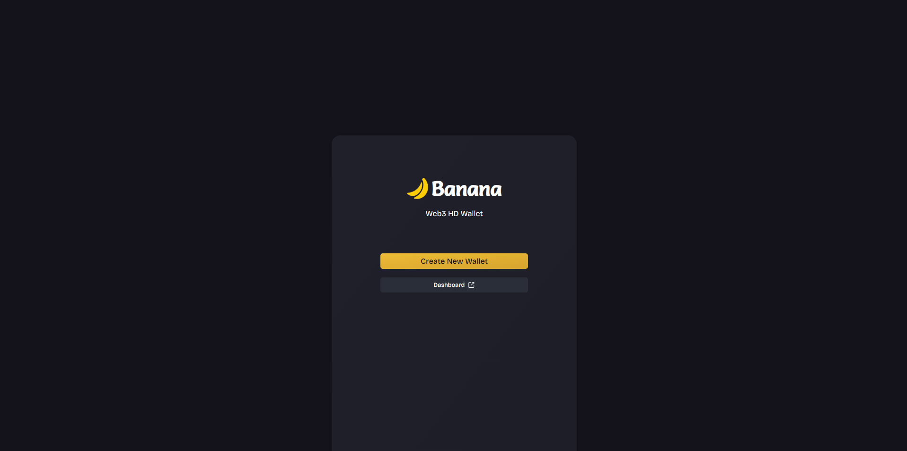

# 🍌 Banana Web3 Wallet

A lightweight, non-custodial Solana wallet built for Devnet and Testnet environments. Perfect for developers testing dApps and users learning Solana Web3 development.

[](https://banana-web3-wallet.vercel.app/)
[](https://solana.com)
[](LICENSE)

## 🌟 Features

- **🔐 Secure Wallet Creation** - Generate new wallets with BIP39 mnemonic seed phrases
- **💼 Multi-Account Management** - Handle multiple wallet addresses from a single interface
- **🌐 Network Switching** - Toggle between Solana Devnet and Testnet RPC endpoints
- **💸 Token Transfers** - Send and receive SOL with real-time balance updates
- **📊 Transaction History** - View detailed transaction records and activity
- **🔑 Wallet Import/Export** - Restore wallets using seed phrases or private keys
- **📱 Responsive Design** - Optimized for desktop and mobile devices
- **⚡ Fast & Lightweight** - No browser extensions required

## 🚀 Live Demo

Check out the live application: **[banana-web3-wallet.vercel.app](https://banana-web3-wallet.vercel.app/)**

## 📸 Showcase

[](https://www.youtube.com/watch?v=8Ru921NwJX0)

[](https://www.youtube.com/watch?v=8Ru921NwJX0)


## 🛠️ Tech Stack

- **Frontend Framework**: React / Next.js
- **Blockchain Integration**: @solana/web3.js
- **Wallet Standards**: BIP39, BIP44 derivation paths
- **Styling**: Tailwind CSS / CSS Modules
- **State Management**: React Context 
- **Deployment**: Vercel
- **Package Manager**: npm / yarn / pnpm

## 📋 Prerequisites

Before you begin, ensure you have the following installed:

- Node.js (v16 or higher)
- npm / yarn / pnpm
- Git

## 🔧 Installation

1. **Clone the repository**
```bash
   git clone https://github.com/yourusername/banana-web3-wallet.git
   cd banana-web3-wallet
```

2. **Install dependencies**
```bash
   npm install
   # or
   yarn install
   # or
   pnpm install
```

4. **Run the development server**
```bash
   npm run dev
   # or
   yarn dev
   # or
   pnpm dev
```

5. **Open your browser**
   
   Navigate to [http://localhost:3000](http://localhost:3000)

## 📖 Usage

### Creating a New Wallet

1. Click on **"Create New Wallet"**
2. Securely store your 12/24-word seed phrase
3. Confirm your seed phrase
4. Your wallet is ready to use!

### Importing an Existing Wallet

1. Click on **"Import Wallet"**
2. Enter your seed phrase or private key
3. Your wallet will be restored with full access

### Sending SOL

1. Navigate to the **"Send"** section
2. Enter the recipient's wallet address
3. Specify the amount of SOL to send
4. Confirm the transaction
5. Track your transaction in the history

### Requesting Testnet SOL

For testing purposes, you can request SOL from faucets:
- **Devnet Faucet**: [https://faucet.solana.com](https://faucet.solana.com)
- Use the faucet to get free SOL for testing

### Requesting Testnet USDC
- **Circle Faucet**: [https://faucet.circle.com](https://faucet.circle.com)
- Select Network to **Solana Devnet**.
- Request to get free USDC for testing

## 🏗️ Project Structure
```
banana-web3-assignment/
├── .gitignore
├── README.md
├── app/
│   ├── create/
│   │   └── page.tsx      # Create Wallet Page
│   ├── dashboard/
│   │   └── page.tsx      # Create Dashboard Page
│   ├── globals.css       
│   ├── layout.tsx
│   └── page.tsx
├── components/
│   ├── CreateBlocks/     # Create Page Components
│   │   ├── AutoGenerateWords.tsx
│   │   ├── Recover12Words.tsx
│   │   ├── Recover24Words.tsx
│   │   ├── SetPassword.tsx
│   │   └── Words.tsx
│   ├── DashboardBlocks/  # Dashboard Page Components
│   │   ├── AccountBlock.tsx
│   │   ├── BalanceDisplayCard.tsx
│   │   ├── ContextMenu.tsx
│   │   ├── CopyKeyBlock.tsx
│   │   ├── HeadingBlock.tsx
│   │   ├── InteractButtons.tsx
│   │   ├── Sidebar.tsx
│   │   └── popups/
│   │       ├── PasswordPopup.tsx
│   │       ├── Popup.tsx
│   │       └── SendPopup.tsx
│   ├── EnterPassword.tsx
│   ├── ViewWords.tsx
│   └── ui/                # UI Components
├── context/
│   └── context.ts         # Context API Store
├── lib/
│   ├── types.ts           # Types
│   ├── utils.ts           # Helper Functions
│   └── web3.ts            # Web3 Functions
├── public/                # Static Files
└── tsconfig.json
```

## 🔒 Security

⚠️ **Important Security Notice**

- This wallet is designed for **Devnet/Testnet ONLY**
- **Never use this wallet with mainnet or real funds**
- **Never share your seed phrase or private keys**
- Seed phrases are stored locally in your browser
- Clear browser data will erase your wallet (backup your seed phrase!)
- This is a learning/testing tool, not production-ready

### Best Practices

- Always backup your seed phrase in a secure location
- Use strong passwords for encryption
- Never enter seed phrases on untrusted websites
- Test with small amounts first
- Regularly clear test wallets and regenerate for security practice

## 🤝 Contributing

Contributions are welcome! Please follow these steps:

1. Fork the repository
2. Create a feature branch (`git checkout -b feature/AmazingFeature`)
3. Commit your changes (`git commit -m 'Add some AmazingFeature'`)
4. Push to the branch (`git push origin feature/AmazingFeature`)
5. Open a Pull Request


## 📄 License

This project is licensed under the MIT License - see the [LICENSE](LICENSE) file for details.

## 👨‍💻 Author

Sarthak Kadam
- GitHub: [@yourusername](https://github.com/yourusername)
- Twitter: [@yourhandle](https://twitter.com/yourhandle)
- LinkedIn: [Your Profile](https://linkedin.com/in/yourprofile)
---

**⚠️ Disclaimer**: This wallet is for educational and testing purposes only. Use at your own risk. The developers are not responsible for any loss of funds or data.

**Built with 🍌 for the Solana ecosystem**